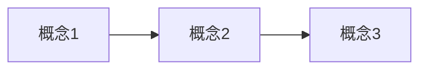

# 技术全景：{{topic-name}}

## 学习目标
- [ ] 学完能独立做出：____

## 已有基础
- ____

## 领域清单
| 领域 | 包含概念 | 学习顺序 |
| --- | --- | --- |
| 领域一 | 概念1、概念2 | 1 |
| 领域二 | 概念3、概念4 | 2 |

## 知识地图

（用 Mermaid flowchart 或 mindmap 画出概念关系，按领域分组）

## 概念关系表
| 概念 | 所属领域 | 前置概念 | 关系说明 |
| --- | --- | --- | --- |
| 概念1 | 领域一 | — | ____ |

## 待验证的推断
- [ ] ____（不确定的事实先记这里，查证后移到"已确认"）
